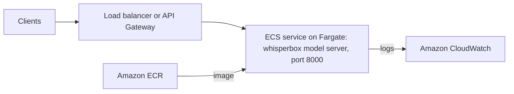

# AWS Deployment Guide

This guide explains how to deploy the Whisperbox model server (the Docker image described in the [Docker Deployment Guide](docker.md)) to AWS.

> **Warning:** The server has no authentication, and its JSON `/transcribe` endpoint transcribes any path inside the container. Don't expose it to the internet as is: restrict access with security groups, or put authentication in front of it (see [Security Considerations](#security-considerations)).

## Architecture Overview

The AWS deployment uses the following components:

1. **Amazon ECR** - For storing Docker images
2. **Amazon ECS/Fargate** - For running containerized applications
3. **Elastic Load Balancing or Amazon API Gateway** - For exposing HTTP endpoints
4. **Amazon CloudWatch** - For logging and monitoring

Files are uploaded to the server over HTTP, and transcripts and the result cache are written to the container's local filesystem, so they are lost when a task stops. The application does not use Amazon S3 (see [S3 Integration](#s3-integration)).



## Prerequisites

- AWS CLI installed and configured
- Docker installed locally
- Basic understanding of AWS services
- An AWS account with permissions to create the necessary resources

## Deployment Steps

### 1. Create an ECR Repository

```bash
aws ecr create-repository --repository-name whisperbox
```

Note the repository URI from the output.

### 2. Build and Push the Docker Image

```bash
# Login to ECR
aws ecr get-login-password | docker login --username AWS --password-stdin <your-account-id>.dkr.ecr.<your-region>.amazonaws.com

# Build the image
docker build -t whisperbox .

# Tag the image
docker tag whisperbox:latest <your-account-id>.dkr.ecr.<your-region>.amazonaws.com/whisperbox:latest

# Push the image
docker push <your-account-id>.dkr.ecr.<your-region>.amazonaws.com/whisperbox:latest
```

Build for the CPU architecture your tasks run on (for example `docker build --platform linux/amd64 ...` on an Apple Silicon Mac for x86 Fargate tasks).

### 3. Create ECS Cluster and Service

For simplicity, we recommend using the AWS Management Console to create an ECS cluster and service:

1. Go to the ECS console
2. Create a new cluster
3. Create a new task definition:
   - Use the Fargate launch type
   - Specify the ECR image URI
   - Map container port 8000
   - Configure CPU and memory (recommend at least 2vCPU and 4GB memory)
   - Add the environment variables listed below. The image does not include your `.env` file.
4. Create a service in your cluster:
   - Use the task definition you created
   - Configure the number of tasks (instances) based on your needs (see [Scaling Considerations](#scaling-considerations) before running more than one)
   - Set up a load balancer if needed. Use `/health` as the health check path, with a grace period long enough for the model to download and load: the server only starts listening after that, which can take several minutes.

### 4. Configure API Gateway (Optional)

If you want to expose your ECS service through a managed API:

1. Create a new REST API in API Gateway
2. Create resources and methods to proxy requests to your ECS service
3. Deploy the API

API Gateway limits request bodies to 10 MB and, by default, waits about 30 seconds for a response, so larger uploads and the synchronous endpoints (`/api/transcribe-sync`, JSON `/transcribe`) fail through it. Clients that upload to `/api/transcribe` and poll `/api/jobs/<id>` work within the timeout; an Application Load Balancer avoids the size limit.

## Environment Variables for AWS

When deploying to AWS, set the following environment variables in your ECS task definition:

```
WHISPER_MODEL=base
OUTPUT_FORMAT=txt
INCLUDE_DIARIZATION=false
FORCE_CPU=true
CACHE_ENABLED=true
HF_TOKEN=your_token_here
```

`HF_TOKEN` is only needed for speaker diarization. The container runs Linux, so it uses the Whisper engine; don't set `TRANSCRIPTION_ENGINE=parakeet`.

## S3 Integration

S3 integration is not currently implemented in the application — files are read
from and written to the container's local filesystem. To use S3 for file storage
instead, modify the application to:

1. Upload files to S3 before processing
2. Download files from S3 when needed
3. Upload transcripts to S3 after processing

You can implement this by adding an S3 client to your application and modifying the file operations.

## Scaling Considerations

- **Vertical Scaling**: Increase the CPU and memory allocation in your task definition
- **Horizontal Scaling**: Increase the number of tasks in your ECS service. Each task keeps its jobs in memory, so a job ID is known only to the task that accepted the upload. Route an upload and its `/api/jobs/<id>` polls to the same task (Application Load Balancer target-group stickiness, which relies on a cookie; the bundled model client sends it back, other clients must too), or use only the synchronous endpoints. Each task loads its own copy of the model and transcribes one file at a time.
- **Spot Instances**: Use Fargate Spot for cost savings on non-critical workloads; jobs in progress are lost when a task is interrupted
- **Auto Scaling**: Configure ECS service auto scaling based on CPU/memory usage

## Cost Optimization

- Use Fargate Spot for non-critical workloads
- Scale down to zero when not in use
- Use smaller Whisper models for lower resource consumption

## Monitoring and Logging

- CloudWatch Logs for container logs
- CloudWatch Metrics for performance monitoring
- CloudWatch Alarms for notifications on issues
- X-Ray for request tracing (optional)

## Security Considerations

- The server has no authentication: allow inbound traffic to port 8000 only from your load balancer or trusted networks, and add authentication in front of it (for example API Gateway authorizers, or an authenticating proxy) before exposing it publicly
- Use IAM roles with least privilege
- Use security groups to restrict network access
- Store sensitive environment variables in AWS Secrets Manager
